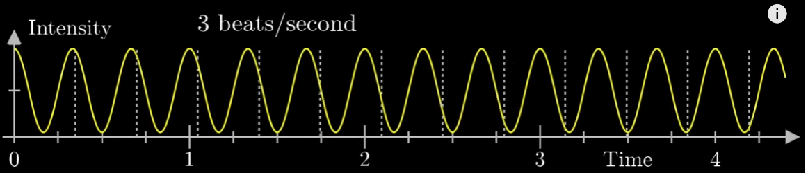

# Fuourier tranform

https://www.youtube.com/watch?v=spUNpyF58BY

* máme nějakou vlnu, třeba cosinus/sinus
* z nějakýho důvodu namapuje vlnu na kruh
* vlna je tak namapovaná, že 2sekundy tvoří kruh -> z toho vyplívá, že máme 0.5 cyklu/sekunda, jelikož 2sekundy tvoří kruh

## Potom tam hovoří něco a nějkým středu hmoty(center of mass) grafu

Ai tvrdí, že circle je tvořen takto $g(t) * e^{-2\pi i f t}$
* g(t) je asi ta vlna, která udává váhu v čase a tvoří tu mandalu

Příklad v blue one brownově videu

* mám squigle s frekvencí 3hz -> číli 3 vlnky za sekundu
* kdbychom chtěli nastavit funkci $g(t) * e^{-2\pi i f t}$, tak aby za 2 sekundy se vykonal jeden cyklus, tak musíme nastavit $f=2$