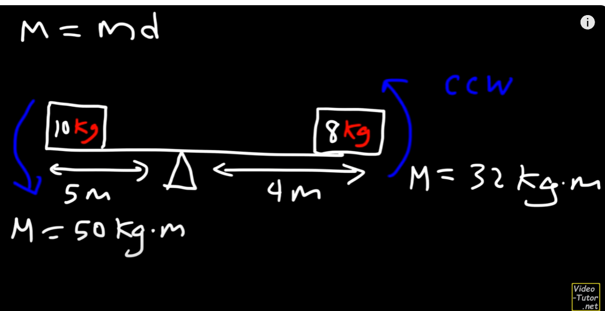

## center of mass

vzorec center of mass $\dfrac{\sum m d}{\sum m} = \text{center of mass}$
* proč to tak je
* d je vzdálenost od vyvažujícího bodu

Příklad:
* 10kg d=-5 -> M = -50
* 8kg d=4 -> M = 32

Chceme najít asi d, takové, aby momenty se rovnaly.
* 10 * (-5 - d) + 8 * (4 - d) = 0 -> -50 - 10d + 32 - 8d = 0 -> -18 = 18d -> d = -1
* derivace vzorce: m1 * (d1 - d) + m2 * (d2 - d) = 0 -> m1 * d1 - m1 * d + m2 * d2 - m2 * d = 0 -> (m1 * d1 + m2 * d2) = (m1 + m2) * d

Použijeme vzorec:
$\dfrac{ -50 + 32 }{18} = -1$ -> dospějeme k stejnému závěru
* vysvětelní vzorce:
    * myšlenka by měla být něco jako, že součet momentů by měl být roven 0
    * lehce neuititivní vzorec, ale když se podívám na to takhle -> total moment = total mass * center of mass

https://www.youtube.com/watch?v=SWu_i-19Rn0

Moment(torque, točivý moment): $mass * distance$ -> distance from the fulcrum
* nějak prostě to davá smysl:
    * větší váha větší chuť se rotovat
    * dleší prkno taky větší chuť se rotovot

## Moment of the particle

Moment x-axis and y-axis = $M_x = m * y$
* y -> displacment on y axis

Souřednice center of mass na x-axis  $\bar{x} = \dfrac{M_x}{M_T}$ -> stejně pro y-axis
* $M_T = \text{total mass}$

## Center of mass of area

Surface density(pro 2D) -> hustota povrchu
* $\rho = m/A$ -> m(mass),A(area) -> říká nám váhu pro jednotku obsahu

Why is displacment y calculated that way than x:
* since we are calculating moment on x_axis $M_x = m * y$
    * mass is $\rho \int_a^b f(x) - g(x)\,dx $
    * we want to add displacment, since integral is calculated over $x$, each point in slice has different displacement, so we use average

